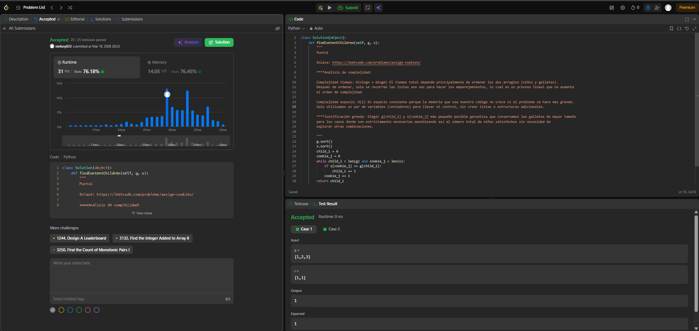
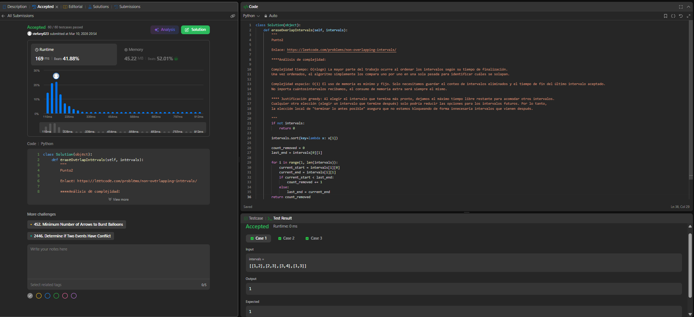
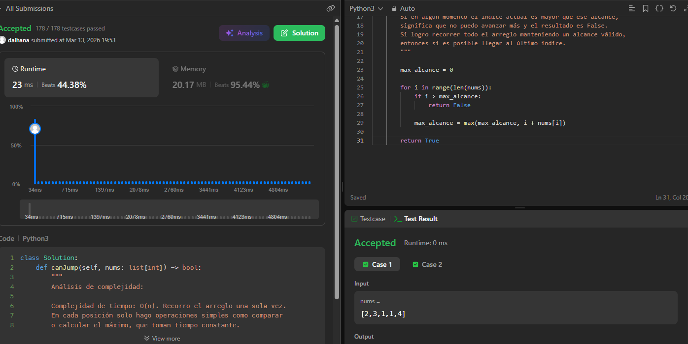
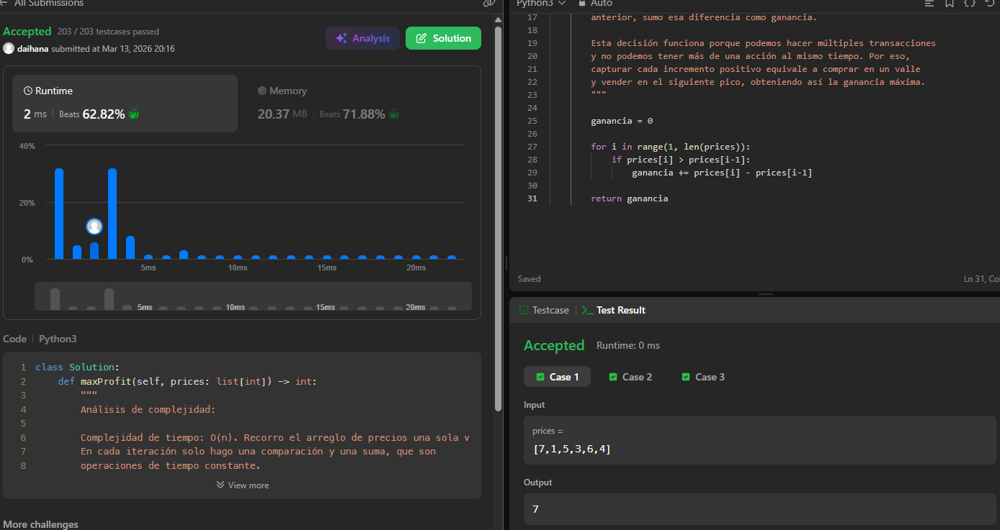

## Punto 1

### Enlace al problema en LeetCode: 
 https://leetcode.com/problems/assign-cookies/
 
### Código de la solución:
```
class Solution(object):
    def findContentChildren(self, g, s):
        g.sort()
        s.sort()
        child_i = 0
        cookie_j = 0
        while child_i < len(g) and cookie_j < len(s):
            if s[cookie_j] >= g[child_i]:
                child_i += 1 
            cookie_j += 1
        return child_i
```
### Pantallazo o comprobante de Accepted:  


### análisis de complejidad:
       Complejidad tiempo: O(nlogn + mlogm) El tiempo total depende principalmente de ordenar los dos arreglos (niños y galletas). 
       Después de ordenar, solo se recorren las listas una vez para hacer los emparejamientos, lo cual es un proceso lineal que no aumenta 
       el orden de complejidad
       
       Complejidad espacio: O(1) Es espacio constante porque la memoria que usa nuestro código no crece si el problema se hace más grande. 
       Solo utilizamos un par de variables (contadores) para llevar el control, sin crear listas o estructuras adicionales.

### justificación greedy: 
       Elegir g[child_i] y s[cookie_j] más pequeño posible garantiza que conservamos las galletas de mayor tamaño 
       para los casos donde son estrictamente necesarias maximizando así el número total de niños satisfechos sin necesidad de
       explorar otras combinaciones.

## Punto 2 

### Enlace al problema en LeetCode: 
https://leetcode.com/problems/non-overlapping-intervals/

### Código de la solución:
```
class Solution(object):
    def eraseOverlapIntervals(self, intervals):
        if not intervals:
            return 0  
        intervals.sort(key=lambda x: x[1])
        count_removed = 0
        last_end = intervals[0][1]
        for i in range(1, len(intervals)):
            current_start = intervals[i][0]
            current_end = intervals[i][1]
            if current_start < last_end:
                count_removed += 1
            else:
                last_end = current_end
        return count_removed
```
### Pantallazo o comprobante de Accepted:  


### análisis de complejidad:
        Complejidad tiempo: O(nlogn) La mayor parte del trabajo ocurre al ordenar los intervalos según su tiempo de finalización. 
        Una vez ordenados, el algoritmo simplemente los compara uno por uno en una sola pasada para identificar cuáles se solapan.

        Complejidad espacio: O(1) El uso de memoria es mínimo y fijo. Solo necesitamos guardar el conteo de intervalos eliminados y el tiempo de fin del último intervalo aceptado. 
        No importa cuántosintervalos recibamos, el consumo de memoria extra será siempre el mismo.

### justificación greedy: 
        Al elegir el intervalo que termina más pronto, dejamos el máximo tiempo libre restante para acomodar otros intervalos. 
        Cualquier otra elección (elegir un intervalo que termine después) solo podría reducir las opciones para los intervalos futuros. Por lo tanto, 
        la elección local de "terminar lo antes posible" asegura que no estamos bloqueando de forma innecesaria intervalos que vienen después.

## Punto 3 

### Enlace al problema en LeetCode: 
https://leetcode.com/problems/jump-game/description/

### Código de la solución:
```
class Solution:
    def canJump(self, nums: list[int]) -> bool:

        max_alcance = 0

        for i in range(len(nums)):
            if i > max_alcance:
                return False

            max_alcance = max(max_alcance, i + nums[i])

        return True
```
### Pantallazo o comprobante de Accepted:  


### análisis de complejidad:
        Análisis de complejidad:

        Complejidad de tiempo: O(n). Recorro el arreglo una sola vez.
        En cada posición solo hago operaciones simples como comparar
        o calcular el máximo, que toman tiempo constante.

        Complejidad de espacio: O(1). Solo utilizo una variable extra
        para guardar el alcance máximo al que puedo llegar, sin crear
        estructuras adicionales.

### justificación greedy:
 Se aplica una estrategia greedy porque en cada posición tomo
        la decisión de actualizar el máximo índice al que puedo llegar.
        Si en algún momento el índice actual es mayor que ese alcance,
        significa que no puedo avanzar más y el resultado es False.
        Si logro recorrer todo el arreglo manteniendo un alcance válido,
        entonces sí es posible llegar al último índice.

## Punto 4 

### Enlace al problema en LeetCode: 
https://leetcode.com/problems/best-time-to-buy-and-sell-stock-ii/submissions/1947473363/

### Código de la solución:
```
class Solution:
    def maxProfit(self, prices: list[int]) -> int:

        ganancia = 0

        for i in range(1, len(prices)):
            if prices[i] > prices[i-1]:
                ganancia += prices[i] - prices[i-1]

        return ganancia
```
### Pantallazo o comprobante de Accepted:  


### análisis de complejidad:
        Análisis de complejidad:

        Complejidad de tiempo: O(n). Recorro el arreglo de precios una sola vez.
        En cada iteración solo hago una comparación y una suma, que son
        operaciones de tiempo constante.

        Complejidad de espacio: O(1). Solo utilizo una variable para guardar
        la ganancia acumulada, sin crear estructuras adicionales.

### justificación greedy:        
        Se utiliza una estrategia greedy porque en cada paso tomo la decisión
        local de aprovechar cualquier subida de precio entre dos días
        consecutivos. Si el precio del día actual es mayor que el del día
        anterior, sumo esa diferencia como ganancia.

        Esta decisión funciona porque podemos hacer múltiples transacciones
        y no podemos tener más de una acción al mismo tiempo. Por eso,
        capturar cada incremento positivo equivale a comprar en un valle
        y vender en el siguiente pico, obteniendo así la ganancia máxima