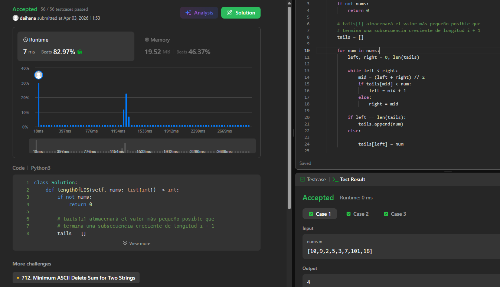
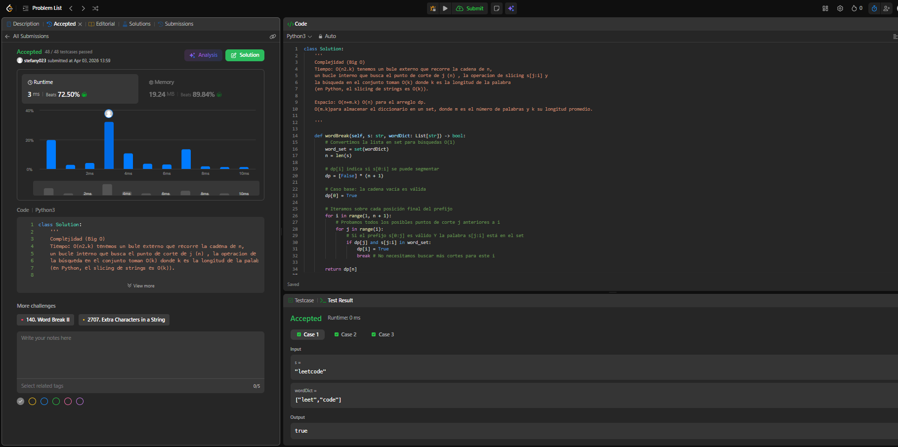

## Punto 1

### Enlace al problema en LeetCode: 
 https://leetcode.com/problems/longest-increasing-subsequence/
 
### Código de la solución:
```
class Solution:
    def lengthOfLIS(self, nums: list[int]) -> int:
        if not nums:
            return 0
        
        tails = []
        
        for num in nums:       
            left, right = 0, len(tails)
            
            while left < right:
                mid = (left + right) // 2
                if tails[mid] < num:
                    left = mid + 1
                else:
                    right = mid
            
            if left == len(tails):
                tails.append(num)
            else:
               
                tails[left] = num
                
        return len(tails)
```
### Pantallazo o comprobante de Accepted:  


### Estado DP:
       Estado DP: tails[i] representa el valor más pequeño posible en el que puede terminar una subsecuencia estrictamente creciente de longitud i + 1. 
       Al mantener el valor final más pequeño para cada longitud posible, maximizamos las oportunidades de que los elementos restantes del arreglo puedan extender dichas subsecuencias. Por ejemplo, si tenemos las secuencias [2, 5, 7] y [1, 3, 4], ambas de longitud 3, el estado tails[2] almacenará el valor 4, ya que es un final más "prometedor" para encontrar números mayores a futuro que el 7

       Complejidad tiempo:  O(n log n). El bucle externo recorre los $n$ elementos del arreglo, y la búsqueda binaria interna toma un tiempo de log n.
       
       Complejidad espacio: O(n), ya que en el peor de los casos (una lista estrictamente creciente), el arreglo tails tendrá el mismo tamaño que nums.

## Punto 2

### Enlace al problema en LeetCode: 
 https://leetcode.com/problems/word-break/
 
### Código de la solución:
```
class Solution:
    def wordBreak(self, s: str, wordDict: List[str]) -> bool:
        word_set = set(wordDict)
        n = len(s)
        dp = [False] * (n + 1)
        dp[0] = True
        for i in range(1, n + 1):
            for j in range(i):
                if dp[j] and s[j:i] in word_set:
                    dp[i] = True
                    break               
        return dp[n]
```
### Pantallazo o comprobante de Accepted:  


### Análisis de Complejidad (Big O) : 
    Tiempo: O(n2.k) tenemos un bule externo que recorre la cadena de n, 
    un bucle interno que busca el punto de corte de j (n) , la operacion de slicing s[j:i] y 
    la búsqueda en el conjunto toman O(k) donde k es la longitud de la palabra 
    (en Python, el slicing de strings es O(k)).
    
    Espacio: O(n+m.k) O(n) para el arreglo dp.
    O(m.k)para almacenar el diccionario en un set, donde m es el número de palabras y k su longitud promedio.
### Estado DP : 
    dp[i]: Representa específicamente si la subcadena que termina justo antes del índice i es procesable.
    Implementación eficiente: Usamos break en el bucle interno: en cuanto encontramos un punto de corte j 
    que hace que el prefijo sea válido, no necesitamos probar otros cortes para esa i específica.
### Problemas en una y dos dimensiones, y patrones típicos:
    Dimensión: Es un problema de 1D (una dimensión). Aunque usamos dos índices ($i, j$), el estado se representa en un 
    arreglo lineal dp[i] que rastrea el progreso a lo largo de la cadena.
    
    Patrón de Partición: A diferencia de "Decode Ways" donde los saltos eran fijos (1 o 2), aquí el "salto" es variable. 
    Es un patrón típico donde debemos decidir dónde "cortar" la cadena para que los fragmentos sean válidos.
    
    Restricciones: El uso de un set para el diccionario es una restricción de eficiencia necesaria para evitar una 
    complejidad $O(n^2 \cdot m)$ si buscáramos en una lista.


    
   
